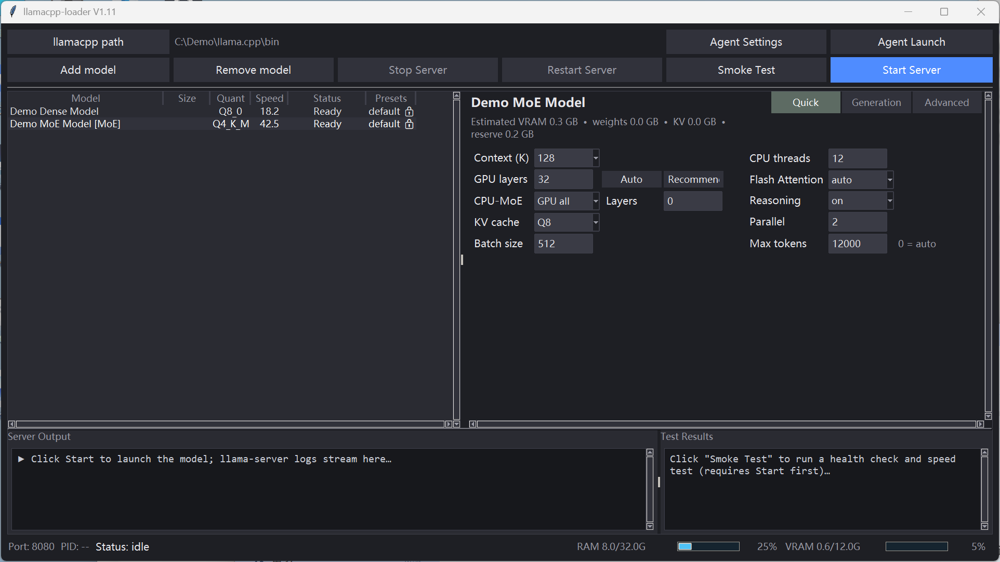

# llamacpp-loader

**Local LLM launcher** — a Tkinter-based graphical manager for running llama.cpp servers.

It folds the whole "pick a model → tune params → launch → test" workflow you used to do with hand-written `.bat` files and sticky notes into a single GUI:

  

---

## 🖼️ GUI Preview (V1.10)



> Current V1.10 preview using fictional model names and paths only. It is intentionally safe to publish and does not contain a user's local configuration.

---

## ✨ Features

| Feature | Description |
|---|---|
| 🎯 **Model management** | Add GGUF models via a file picker; each gets its own auto-generated `ModelProfile` (independent parameters per model) |
| 🔎 **Auto-discovery** | `scan_models()` recursively scans a directory, detects every `.gguf` and builds a readable config |
| ⚙️ **Parameter tuning** | Compact Quick (4+4), Generation, and Advanced tabs for launch, sampling, and optional capability settings |
| 💾 **Parameter persistence** | Model parameters, table widths, splitter positions, and window size are saved between launches |
| 🚀 **One-click launch** | Select model → Start → auto-spawns llama-server → health check passes → **opens the Web UI automatically** |
| 🧪 **Smoke test** | `SmokeTestRunner` checks server health + `scripts/smoke_live.py` measures real throughput (tokens/s) |
| 🛑 **Graceful shutdown** | Stops the process, releases VRAM/RAM, and supports crash auto-restart (watchdog) |
| ⚡ **N-gram spec decoding** | Zero-cost speed-up (no draft model, no extra VRAM) that **stacks** with MTP / DFlash via llama.cpp's comma-separated `--spec-type` |

## 📦 Installation

```bash
# Requires Python 3.10+ (official build, includes tkinter)
git clone https://github.com/beastrobin/llamacpp-loader
cd llamacpp-loader

# Core runtime needs no third-party packages (Tkinter is included with the official Python build).
# Optional: install gguf for automatic MoE / MTP metadata detection.
python -m pip install -e .[dev]
python -m llamacpp_loader.main
```

> ⚠️ Note: `llama-server.exe` (the llama.cpp binary itself) is **not** included in this repo. Download it from the [llama.cpp releases](https://github.com/ggml-org/llama.cpp/releases) page.

## 🚀 Usage

1. **Choose the llama.cpp folder**: click `llamacpp path` and select the directory containing `llama-server.exe`.
2. **Add a model**: click `Add model` and choose a GGUF file; each model receives an independent profile.
3. **Tune parameters**: use `Quick`, `Generation`, and `Advanced`. Quick uses context values in K, KV cache choices F16/Q8/Q4, GPU Auto/Recommend, and balanced 4+4 columns.
4. **Configure optional capabilities**: Advanced provides aligned Vision, MTP, DFlash, and N-gram rows with On/Off, file selection, clear, and status controls. CPU-MoE lives in the Quick tab.
   - **N-gram** is free acceleration (no draft model, no extra VRAM) and *stacks* with the draft tracks: picking `Simple` while MTP is on emits `--spec-type draft-mtp,ngram-simple`. Measured on Qwen3.8-27B: 57 t/s baseline → 87 t/s with MTP → ~117 t/s with MTP + n-gram.
5. **Launch**: click `Start Server`; the app starts llama-server on the configured port and can open the local Web UI.
6. **Smoke test**: click `Smoke Test` after launch, or run `python scripts/smoke_live.py` against a running local server.
7. **Stop**: click `Stop Server` to shut down gracefully; model and layout settings are saved automatically.

## 🏗️ Architecture

```
llamacpp-loader/
├── llamacpp_loader/
│   ├── main.py                    # Entry point: launches the Tkinter app
│   ├── config/store.py            # ModelProfile collection store (per-model params, JSON persistence)
│   │   ├── ModelProfile           # model + ServerParams + InferenceParams + SamplingParams
│   │   ├── ConfigStore            # CRUD + validation + default template + scan_models auto-discovery
│   │   └── ServerParams/...       # host/port, ctx/gpu/threads, temp/top_k/top_p
│   ├── config/recommend.py        # Preset recommendations / baselines
│   ├── config/budget.py           # Conservative VRAM estimates / layer suggestions
│   ├── config/metadata.py         # GGUF metadata reader (MoE / MTP detection)
│   ├── process_manager/manager.py # Subprocess lifecycle management
│   │   ├── ProcessManager         # Popen wrapper + state machine (idle→starting→running→stopping)
│   │   ├── ServerConfig           # Builds llama-server CLI args from a Profile
│   │   └── ProcessWatcher         # Background thread watches for crashes and auto-restarts
│   ├── smoke_test/runner.py       # Post-launch health validation
│   │   ├── SmokeTestRunner        # /health first, falls back to /v1/models on 404
│   │   └── ServerHealthChecker    # Synchronous single-request check (for pytest)
│   ├── gui/app.py                 # Main window, model table, server/test panels, and actions
│   ├── gui/detail_panel.py        # Scrollable Quick/Generation/Advanced parameter editor
│   └── gui/theme.py               # Dark theme styling (colors, fonts, ttk styles)
├── scripts/
│   ├── smoke_live.py              # Live smoke test: health check + throughput (tokens/s)
│   ├── register_all_models.py     # Batch-register GGUF models (MoE/MTP auto-detect)
│   └── e2e_smoke_check.py         # Headless end-to-end Start -> Smoke Test check
├── tests/                         # 70 pytest tests
│   ├── test_config_store.py       # CRUD/validation/persistence/scan_models
│   ├── test_process_manager.py    # lifecycle/command-build/browser
│   ├── test_smoke_test.py         # result construction/endpoint checks
│   ├── test_gui.py                # component creation/state (shared Tk root fixture)
│   ├── test_kv_edit_unlock.py     # KV/ctx/gpu/threads editing vs sampling lock
│   └── test_overlay_double_click.py # changed-cell overlay double-click detection
├── models/                        # Local GGUF model directory
└── logs/                          # Runtime logs
```

## 🧪 Tests

```bash
pip install pytest
pytest tests/ -v          # 90 tests
python scripts/smoke_live.py   # live smoke test (requires llama-server running on 8080)
```

## 📝 Design notes

- **One parameter set per model**: `ModelProfile` binds the model file + launch params + sampling params together, eliminating "switch models and lose my params"
- **Thread safety**: `ConfigStore` uses a Lock, `ProcessManager` locks all state changes, and GUI callbacks run through `root.after()`
- **Robust process management**: graceful SIGTERM + SIGKILL on timeout + background watchdog for crash self-healing
- **Core runtime is dependency-free**: pure Python standard library, works out of the box. An **optional** `gguf` package (`pip install gguf`) auto-detects MoE / MTP model metadata during `scan_models()` — without it the tool still launches and runs, just without that metadata enhancement.

## 📄 License

MIT
